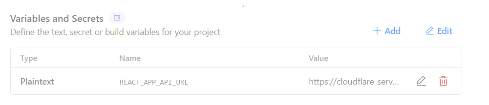
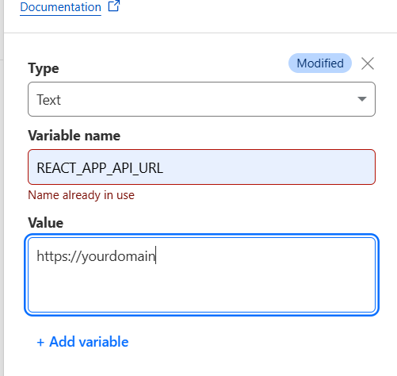

# 1 K Words — Personal Vocabulary Trainer

*A lightweight flash‑card app that helps you master the 1 000 most‑common words in any language. Easily import your own language packs.*


## Features

| Feature                   | Description                                                                                                          |
| ------------------------- | -------------------------------------------------------------------------------------------------------------------- |
| **Two learning modes**    | *Vocabulary* — flip the card to reveal the translation.<br>*Learn* — type the answer and receive immediate feedback. |
| **Smart repetition**      | Words you miss are shown **5 ×** more often than words you answer correctly.                                         |
| **Session progress**      | A compact progress bar displays how many unique words you’ve seen and the lowest repetition count (e.g. **2 / 3**).  |
| **Custom language packs** | Import any language using the JSON template in **`test_data/`**.                                                     |
| **Multi‑user support**    | Each user sees only the words they imported.                                                                         |
| **Cross‑platform app**    | .NET MAUI wrapper runs the web app on Windows and Android (iOS/macOS untested).                                      |


## Quick Start

### 1 Client
```bash
npm install
npm run start
```

The client starts at **[http://localhost:3000](http://localhost:3000)** by default.

## 2 · Choose a back‑end

You can self‑host with **Node.js** or deploy for free on **Cloudflare Workers-Pages**.

## 2 a · Cloudflare Workers

1. ### Install dependencies

```bash
npm install
```
2. ### Create the database

```bash
npx wrangler d1 create <DB_NAME>
npx wrangler d1 migrations create <DB_NAME> <MIGRATION_NAME>
npx prisma migrate diff --from-empty --to-schema-datamodel ./src/prisma/schema.prisma --script --output migrations/<MIGRATION_NAME>.sql # push migarion
npx wrangler d1 migrations apply <DB_NAME> --local   # local DB
npx wrangler d1 migrations apply <DB_NAME> --remote  # remote DB
```

3. ### Type generation & dev server

```bash
npx prisma generate
npm run cf-typegen
npm run start
```
4. ### Deploy

```bash
npm run deploy
```

5. ### Connect the Page to Server
go to settings press add Variables and Secrets  


then add it like below  


## 2 b · Node.js (self‑host)

```bash
npm install
npx prisma migrate dev --name init
npm run start
```

### 3 · HTTP / HTTPS Configuration

#### HTTP (default)

1. Rename `.env.http.example` to `.env`.
2. Set `APP_API_URL` in the client `.env` to `http://localhost:4000`.
3. set `AppConfig` in the MAUI app to `http://localhost:4000`.

#### HTTPS (optional)

1. Copy `.env.https.example` to `.env` and set `KEY_PATH` & `CERT_PATH`.
2. No need to Change `AppConfig` or `.env` the default runs on HTTPS
2. Generate local certificates with **mkcert**:

   ```bash
   mkcert -install
   mkcert localhost 127.0.0.1 ::1
   ```


### 4 · MAUI Desktop / Mobile App

* **Windows** — Enable Developer Mode.  
* **Android** — Install JDK 17 and connect a device or emulator.

Then run:

```bash
dotnet workload repair
dotnet workload update
````


## Roadmap

* **Word sequences** — Server sends batches of 5–50 words instead of the full list.
* **Word sets** — Public sets can be shared and downloaded by other users.
* **Database improvements** — Seamless switching between languages with accurate progress tracking.
* **Responsive design** — Adapt to different screen sizes.
* **User settings** — Dark mode and improved layout options.
* **Mobile/Desktop apps** — Complete testing on all MAUI targets.
* **Notifications** — Reminders in apps to keep learning.
* **XP / gamification** — Increase user engagement.


## License

```text
MIT License

Copyright (c) 2025  1 K Words

Permission is hereby granted, free of charge, to any person obtaining a copy
of this software and associated documentation files (the "Software"), to deal
in the Software without restriction, including without limitation the rights
to use, copy, modify, merge, publish, distribute, sublicense, and/or sell
copies of the Software, and to permit persons to whom the Software is
furnished to do so, subject to the following conditions:

The above copyright notice and this permission notice shall be included in all
copies or substantial portions of the Software.

THE SOFTWARE IS PROVIDED "AS IS", WITHOUT WARRANTY OF ANY KIND, EXPRESS OR
IMPLIED, INCLUDING BUT NOT LIMITED TO THE WARRANTIES OF MERCHANTABILITY,
FITNESS FOR A PARTICULAR PURPOSE AND NONINFRINGEMENT. IN NO EVENT SHALL THE
AUTHORS OR COPYRIGHT HOLDERS BE LIABLE FOR ANY CLAIM, DAMAGES OR OTHER
LIABILITY, WHETHER IN AN ACTION OF CONTRACT, TORT OR OTHERWISE, ARISING FROM,
OUT OF OR IN CONNECTION WITH THE SOFTWARE OR THE USE OR OTHER DEALINGS IN THE
SOFTWARE.
```
